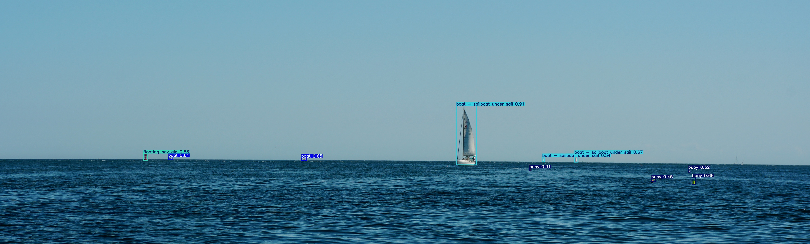

<p align="center">
  
</p>

# NOMaD – Navigational Objects Maritime (annotated) Dataset

This repository contains the **annotation specification and class/super-class definitions** for NOMaD. It does not contain the imagery or annotations themselves; the distribution of those can be found below.

NOMaD is an object classification spec focused on maritime navigation. This README documents the full class list (69 classes in 7 categories) and how to use super-class groupings to adapt the spec for your use case.

- **Classes:** 69  
- **Categories:** 7  
- **Spec version:** 1.2.0 (2026)

## Dataset

The accompanying annotated imagery contains maritime images from various sources representing the diverse maritime domain. The dataset is hosted on Hugging Face:

**[NOMaD Dataset on Hugging Face](https://huggingface.co/datasets/CCOM-ASV-LAB/NOMaD/tree/main)**

The dataset uses the class IDs, names, and categories defined in **this repository**. Annotations are provided in COCO-style format; the category schema in this repo (see `coco_spec.json`) matches that structure.

## Data path convention

Scripts in this repository should resolve the dataset path in this order:

1. `NOMAD_DATA_DIR` environment variable (if set)
2. `./data` in this repository

The `data/` directory is treated as a local cache and its contents are ignored by git.

## Sync dataset locally

### Requirements

- Python 3.9+
- `huggingface_hub` Python package

Install dependency:

```bash
python -m pip install huggingface_hub
```

### Quickstart

```bash
# Optional: choose a custom location for dataset files
export NOMAD_DATA_DIR="/path/to/nomad-data"

# Download/update the dataset into NOMAD_DATA_DIR or ./data
python scripts/sync_dataset.py
```

### Reproducible snapshot (recommended for experiments)

```bash
python scripts/sync_dataset.py --revision "<tag-or-commit>"
```

### Selective download

```bash
python scripts/sync_dataset.py \
  --allow-pattern "annotations/*" \
  --allow-pattern "images/train/*"
```

## Repository contents


| Asset                               | Description                                                                                                                         |
| ----------------------------------- | ----------------------------------------------------------------------------------------------------------------------------------- |
| `detailed_class_specification.json` | Full 69-class spec with descriptions, visual characteristics, typical size range, and color markers.                                |
| `coco_spec.json`                    | COCO-format category template for the same classes (for use with COCO-style annotations).                                           |
| `super-classes/`                    | JSON files that define groupings of the main spec into fewer classes (e.g. `base_superclasses.json`). One file per grouping scheme. |
| `scripts/sync_dataset.py`           | Downloads/syncs NOMaD dataset files from Hugging Face into local storage (`NOMAD_DATA_DIR` or `./data`).                            |
| `data/`                             | Default local dataset cache location used by scripts (git-ignored except placeholders/docs).                                        |


## Super-classing

Super classes can be useful to transform the dataset for a specific use case. NOMaD is meant to have a very granular classification scheme that can be easily adapted to many areas of research in the maritime domain. For example, if you want a robust model without concern for classifying boat types, you might collapse boat classes into "large_boat" and "small_boat" super classes and drop type-specific granularity. If you're working on a model that geolocates clusters of fishing buoys from an ASV, you might keep only the granularity of the buoy classes and collapse the rest specs classes.

The `**super-classes/**` folder holds one JSON file per grouping scheme. The main spec is `detailed_class_specification.json` in the repo root (69 classes). Each super-class JSON defines **groups** with:

- `**name`** – The class name for that group.
- `**subclass_ids**` – Main-spec class IDs that belong to this group.

One file = one way of grouping the main spec into fewer classes. Add new files for other schemes (e.g. `marine_core.json`).

## Table of contents

- [Repository contents](#repository-contents)
- [Super-classing](#super-classing)
- [Boat](#boat)
- [Dayshape](#dayshape)
- [Flag](#flag)
- [Lights](#lights)
- [Structure](#structure)
- [Nav Aid](#nav-aid)
- [Buoy](#buoy)

## Boat


| ID  | Class name                       | Description                                                             | Visual characteristics                                                      | Size range      | Color markers                                        |
| --- | -------------------------------- | ----------------------------------------------------------------------- | --------------------------------------------------------------------------- | --------------- | ---------------------------------------------------- |
| 0   | boat                             | Generic boat or vessel when specific type cannot be determined          | Variable vessel characteristics, unable to classify into specific boat type | Variable        | Variable                                             |
| 1   | boat - tug                       | Tugboat used for towing or pushing other vessels                        | Compact, powerful hull with high freeboard, often brightly colored          | 15-50 meters    | Often red, yellow, or orange hull                    |
| 2   | boat - sailboat under power      | Sailboat operating with engine power, sails down                        | Mast present, engine wake visible, sails furled                             | 5-30 meters     | Variable, white hulls common                         |
| 3   | boat - sailboat under sail       | Sailboat operating solely under wind power                              | Sails deployed, mast visible, minimal or no wake                            | 5-30 meters     | Variable, white hulls and sails common               |
| 4   | boat - submarine                 | Submersible naval vessel                                                | Cigar-shaped hull, conning tower, minimal superstructure                    | 50-170 meters   | Typically dark gray or black                         |
| 5   | boat - warship                   | Military naval vessel                                                   | Large, angular superstructure, weapons systems visible                      | 50-300+ meters  | Gray hull, military gray paint scheme                |
| 6   | boat - merchant ship             | Commercial cargo or container vessel                                    | Large rectangular superstructure, cargo containers or holds visible         | 100-400+ meters | Often red hull below waterline, variable above       |
| 7   | boat - commercial fishing boat   | Commercial fishing vessel with nets, trawls, or other fishing equipment | Fishing gear visible, working deck, often smaller to medium size            | 10-80 meters    | Variable, often white or blue hull                   |
| 8   | boat - recreational fishing boat | Small to medium recreational fishing vessel                             | Open or partially enclosed deck, fishing rods visible, smaller size         | 3-15 meters     | Variable, often bright colors                        |
| 9   | boat - pleasure craft            | Recreational motorboat or yacht                                         | Clean lines, often sleek design, no commercial equipment                    | 5-50 meters     | Variable, often white or bright colors               |
| 10  | boat - personal watercraft       | Jet ski, wave runner, or similar small personal watercraft              | Very small, low profile, high speed capability                              | 2-4 meters      | Often bright colors, white common                    |
| 11  | boat - kayak_canoe               | Human-powered kayak or canoe                                            | Very small, low profile, paddlers visible                                   | 2-6 meters      | Variable, often bright colors for visibility         |
| 12  | boat - seaplanes                 | Aircraft capable of landing on water                                    | Aircraft fuselage with floats or hull, wings visible                        | 8-20 meters     | Variable, often white or bright colors               |
| 13  | boat - ferry                     | Passenger or vehicle ferry vessel                                       | Large, boxy superstructure, multiple decks, vehicle ramps                   | 30-200 meters   | Variable, often company colors                       |
| 14  | boat - barge                     | Flat-bottomed cargo vessel, often towed                                 | Rectangular, low profile, minimal superstructure                            | 20-200 meters   | Often rust-colored or gray                           |
| 15  | boat - dredger                   | Vessel equipped for dredging operations                                 | Large equipment visible, often stationary or slow-moving                    | 20-150 meters   | Often yellow or orange equipment                     |
| 16  | boat - law enforcement           | Law enforcement or coast guard vessel                                   | Often high-speed capable, blue lights or markings                           | 5-50 meters     | Often blue, white, or official colors                |
| 17  | boat - unclassified boat         | Boat that cannot be classified into specific categories                 | Variable                                                                    | Variable        | Variable                                             |
| 18  | boat - drilling ship             | Offshore drilling platform or vessel                                    | Large, complex superstructure, drilling equipment visible                   | 100-300+ meters | Often yellow or orange equipment, white or gray hull |


## Dayshape


| ID  | Class name                                         | Description                                                                                   | Visual characteristics                                                            | Size range              | Color markers |
| --- | -------------------------------------------------- | --------------------------------------------------------------------------------------------- | --------------------------------------------------------------------------------- | ----------------------- | ------------- |
| 19  | dayshape                                           | Generic day shape or navigation status indicator when specific type cannot be determined      | Variable dayshape characteristics, unable to classify into specific dayshape type | Variable                | Variable      |
| 20  | dayshape - not under command                       | Day shape indicating vessel not under command (two black balls)                               | Two black spherical shapes, one above the other                                   | 0.6-1.0 meters diameter | Black         |
| 21  | dayshape - restricted in ability to maneuver       | Day shape indicating vessel restricted in ability to maneuver (ball-diamond-ball)             | Three shapes: ball, diamond, ball, vertically arranged                            | 0.6-1.0 meters          | Black         |
| 22  | dayshape - constrained by draft                    | Day shape indicating vessel constrained by draft (cylinder)                                   | Cylindrical black shape                                                           | 0.6-1.0 meters          | Black         |
| 23  | dayshape - pilot vessel on duty                    | Day shape indicating pilot vessel on duty (ball over flag)                                    | Black ball above flag shape                                                       | 0.6-1.0 meters          | Black         |
| 24  | dayshape - anchored                                | Day shape indicating vessel at anchor (ball)                                                  | Single black spherical shape                                                      | 0.6-1.0 meters diameter | Black         |
| 25  | dayshape - vessel under sail and power             | Day shape indicating vessel under sail and power (cone apex down)                             | Black cone with apex pointing downward                                            | 0.6-1.0 meters          | Black         |
| 26  | dayshape - towing or towed vessel                  | Day shape indicating towing or towed vessel (diamond)                                         | Black diamond shape                                                               | 0.6-1.0 meters          | Black         |
| 27  | dayshape - fishing with restricted maneuverability | Day shape indicating fishing vessel with restricted maneuverability (two cones apex together) | Two black cones with apexes together                                              | 0.6-1.0 meters          | Black         |
| 28  | dayshape - minesweeping                            | Day shape indicating minesweeping operations (three balls)                                    | Three black spherical shapes                                                      | 0.6-1.0 meters          | Black         |
| 29  | dayshape - aground                                 | Day shape indicating vessel aground (three balls)                                             | Three black spherical shapes                                                      | 0.6-1.0 meters          | Black         |


## Flag


| ID  | Class name        | Description                                          | Visual characteristics                                                    | Size range     | Color markers |
| --- | ----------------- | ---------------------------------------------------- | ------------------------------------------------------------------------- | -------------- | ------------- |
| 30  | flag              | Generic flag when specific type cannot be determined | Variable flag characteristics, unable to classify into specific flag type | Variable       | Variable      |
| 31  | flag - dive flag  | Diver down flag (red with white diagonal stripe)     | Rectangular flag, red field with white diagonal stripe                    | 0.5-1.0 meters | Red and white |
| 32  | flag - pilot flag | Pilot flag indicating pilot vessel or pilot on board | Rectangular flag, typically white over red horizontal stripes             | 0.5-1.0 meters | White and red |


## Lights


| ID  | Class name                                  | Description                                                                        | Visual characteristics                                                        | Size range          | Color markers             |
| --- | ------------------------------------------- | ---------------------------------------------------------------------------------- | ----------------------------------------------------------------------------- | ------------------- | ------------------------- |
| 33  | lights                                      | Generic navigation lights when specific configuration cannot be determined         | Variable lights characteristics, unable to classify into specific lights type | Variable            | Variable                  |
| 34  | lights - power driven vessels               | Navigation lights for power-driven vessel (red port, green starboard, white stern) | Red light on port side, green on starboard, white stern light                 | Small point sources | Red, green, white         |
| 35  | lights - power driven vessel towing < 200 m | Navigation lights for power vessel towing with tow length less than 200 meters     | Standard lights plus yellow towing light                                      | Small point sources | Red, green, white, yellow |
| 36  | lights - power driven vessel towing > 200 m | Navigation lights for power vessel towing with tow length greater than 200 meters  | Standard lights plus three white masthead lights in vertical line             | Small point sources | Red, green, white         |
| 37  | lights - fishing trawler                    | Navigation lights for fishing trawler (red over white)                             | Red light over white light, both visible all around                           | Small point sources | Red and white             |
| 38  | lights - fishing not trawling               | Navigation lights for fishing vessel not trawling (red over red)                   | Two red lights, one over the other, both visible all around                   | Small point sources | Red                       |
| 39  | lights - not under command                  | Navigation lights for vessel not under command (red over red)                      | Two red lights, one over the other, both visible all around                   | Small point sources | Red                       |
| 40  | lights - restricted in ability to maneuver  | Navigation lights for vessel restricted in ability to maneuver (red-white-red)     | Three lights in vertical line: red, white, red, all visible all around        | Small point sources | Red and white             |
| 41  | lights - constrained by draft               | Navigation lights for vessel constrained by draft (three red lights)               | Three red lights in vertical line, all visible all around                     | Small point sources | Red                       |
| 42  | lights - pilot vessel on duty               | Navigation lights for pilot vessel on duty (white over red)                        | White light over red light, both visible all around                           | Small point sources | White and red             |
| 43  | lights - anchored or aground                | Navigation lights for vessel at anchor or aground (white all around)               | White light visible all around, may be two if vessel over 50m                 | Small point sources | White                     |


## Structure


| ID  | Class name                    | Description                                               | Visual characteristics                                                              | Size range                                 | Color markers                                             |
| --- | ----------------------------- | --------------------------------------------------------- | ----------------------------------------------------------------------------------- | ------------------------------------------ | --------------------------------------------------------- |
| 44  | structure                     | Generic structure when specific type cannot be determined | Variable structure characteristics, unable to classify into specific structure type | Variable                                   | Variable                                                  |
| 45  | structure - drilling platform | Offshore drilling platform or rig                         | Large fixed or floating structure, drilling equipment visible                       | 50-200+ meters                             | Often yellow or orange equipment, white or gray structure |
| 46  | structure - piling            | Vertical piling or post structure                         | Vertical cylindrical or square post, often in groups                                | 0.3-2 meters diameter, 5-30+ meters height | Variable, often wood, concrete, or metal                  |
| 47  | structure - dock              | Dock or wharf structure                                   | Horizontal platform extending into water, often with pilings                        | 10-500+ meters                             | Variable, often wood, concrete, or metal                  |
| 48  | structure - pier              | Pier or jetty structure                                   | Narrow structure extending into water, often perpendicular to shore                 | 5-200+ meters                              | Variable, often wood, concrete, or metal                  |
| 49  | structure - bridge            | Bridge structure over waterway                            | Large spanning structure, supports visible                                          | 50-1000+ meters span                       | Variable, often gray or painted                           |
| 50  | structure - unknown structure | Unidentified or unclassified structure                    | Variable                                                                            | Variable                                   | Variable                                                  |


## Nav Aid


| ID  | Class name                                           | Description                                                                           | Visual characteristics                                                          | Size range            | Color markers                          |
| --- | ---------------------------------------------------- | ------------------------------------------------------------------------------------- | ------------------------------------------------------------------------------- | --------------------- | -------------------------------------- |
| 51  | nav aid                                              | Generic navigation aid when specific type cannot be determined                        | Variable nav aid characteristics, unable to classify into specific nav aid type | Variable              | Variable                               |
| 52  | nav aid - port side green floating channel marker    | Green floating channel marker indicating port side of channel (US: keep to starboard) | Green can or nun buoy, may have number or letter                                | 0.5-2 meters          | Green                                  |
| 53  | nav aid - starboard side red floating channel marker | Red floating channel marker indicating starboard side of channel (US: keep to port)   | Red nun or can buoy, may have number or letter                                  | 0.5-2 meters          | Red                                    |
| 54  | nav aid - yellow-floating-hazard-marker              | Yellow floating marker indicating hazard or special area                              | Yellow buoy or marker, may have various shapes                                  | 0.5-2 meters          | Yellow                                 |
| 55  | nav aid - junction preferred channel to stbd         | Junction marker indicating preferred channel to starboard                             | Red and green horizontal bands, top band red                                    | 0.5-2 meters          | Red and green                          |
| 56  | nav aid - junction preferred channel to port         | Junction marker indicating preferred channel to port                                  | Red and green horizontal bands, top band green                                  | 0.5-2 meters          | Red and green                          |
| 57  | nav aid - safe-water-floating-channel-marker         | Safe water marker indicating navigable water all around                               | Red and white vertical stripes, spherical or pillar shape                       | 0.5-2 meters          | Red and white                          |
| 58  | nav aid - regulatory markers                         | Regulatory marker indicating rules or restrictions                                    | White with orange border and symbol, various shapes                             | 0.5-2 meters          | White and orange                       |
| 59  | nav aid - range marker                               | Range marker for alignment navigation                                                 | Two markers in line, often daymarks or lights                                   | Variable              | Variable, often red or white           |
| 60  | nav aid - lighthouse                                 | Lighthouse structure for navigation                                                   | Tall tower structure, often distinctive shape and color                         | 10-100+ meters height | Variable, often white, red, or striped |
| 61  | nav aid - red triangle daymark                       | Red triangular daymark for navigation                                                 | Red triangular shape, often on post or structure                                | 0.5-2 meters          | Red                                    |
| 62  | nav aid - green square daymark                       | Green square daymark for navigation                                                   | Green square shape, often on post or structure                                  | 0.5-2 meters          | Green                                  |
| 63  | nav aid - special yellow square marker               | Special yellow square marker                                                          | Yellow square shape                                                             | 0.5-2 meters          | Yellow                                 |
| 64  | nav aid - special yellow triangle marker             | Special yellow triangle marker                                                        | Yellow triangular shape                                                         | 0.5-2 meters          | Yellow                                 |
| 65  | nav aid - regulatory marker                          | Regulatory marker (alternative classification)                                        | White with orange border and symbol                                             | 0.5-2 meters          | White and orange                       |


## Buoy


| ID  | Class name          | Description                                          | Visual characteristics                                              | Size range              | Color markers                                       |
| --- | ------------------- | ---------------------------------------------------- | ------------------------------------------------------------------- | ----------------------- | --------------------------------------------------- |
| 66  | buoy                | Generic buoy when specific type cannot be determined | Floating marker or buoy, unable to classify into specific buoy type | Variable                | Variable                                            |
| 67  | buoy - mooring ball | Mooring ball for vessel mooring                      | Spherical or cylindrical float, often white or blue                 | 0.3-1.0 meters diameter | Often white, blue, or yellow                        |
| 68  | buoy - fishing buoy | Fishing buoy marking fishing gear or trap            | Small float, often brightly colored, may have flag                  | 0.2-0.5 meters diameter | Variable, often bright colors (orange, yellow, red) |


---

**License:** This specification is intended for research use (see `coco_spec.json` for license details).